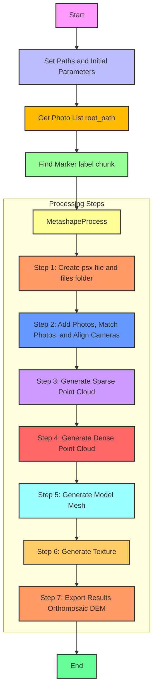

# Reef Mapper
This script automates the batch processing of georeferenced, time-series coral reef photomosaics using Agisoft Metashape. It follows the Structure-from-Motion (SfM) workflow to generate 3D models and mosaics from photographic images of coral reefs. The script is designed to handle large datasets and streamline the processing pipeline for efficient monitoring and analysis. It includes functions for reading image files, processing them using Agisoft Metashape, and logging the processing details. Key features include:

- Automatic generation of 3D models and mosaics
- Handling of batch processing
- Logging of processing steps and results
- Integration with external libraries such as html2text

## Overview
### Batch Processing Flow Diagram

## Installation
To run this script, you need to have Python and Agisoft Metashape installed on your system. Additionally, you need to install the required Python packages. You can install the necessary packages using the following steps:
1. Ensure you have Python installed. If not, download and install Python from [python.org](https://www.python.org/).
2. Install the required packages using `pip`. You can create a `requirements.txt` file with the following content:
```
pip install -r requirements.txt
```
## Usage
To use the script, follow these steps:
Set the Path and Filename for the Processing Log: Update the process_log variable in the script with the path and filename of your processing log CSV file.
```
process_log = 'N:\\StRS_Sites\\2024\\MP2404_MHI\\OAH\\StRS_Sites_2024_ProcessingLog_V1.csv'
```
Set the Batch Number: Set the batch_no variable to the number of the batch you want to process.
```
batch_no = 1  # Set the number of batch to be processed (1-n)
```
Run the Script using Python
```
python SfMBatchProcess_1_1.py
```

### License
See the [LICENSE.md](./LICENSE.md) for details

### Disclaimer
This repository is a scientific product and is not official communication of the National Oceanic and Atmospheric Administration, or the United States Department of Commerce. All NOAA GitHub project code is provided on an ‘as is’ basis and the user assumes responsibility for its use. Any claims against the Department of Commerce or Department of Commerce bureaus stemming from the use of this GitHub project will be governed by all applicable Federal law. Any reference to specific commercial products, processes, or services by service mark, trademark, manufacturer, or otherwise, does not constitute or imply their endorsement, recommendation or favoring by the Department of Commerce. The Department of Commerce seal and logo, or the seal and logo of a DOC bureau, shall not be used in any manner to imply endorsement of any commercial product or activity by DOC or the United States Government.
