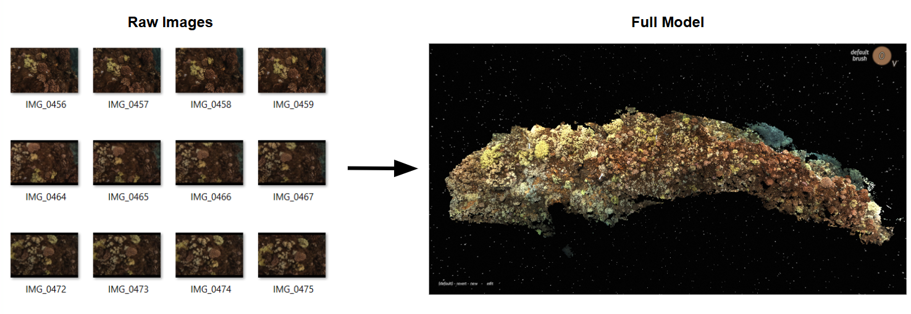
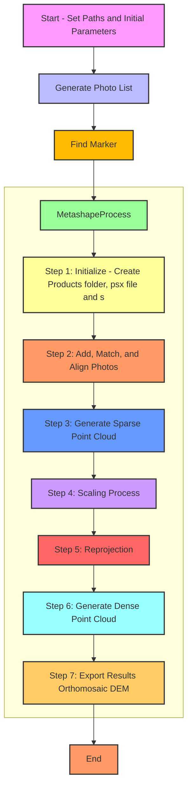
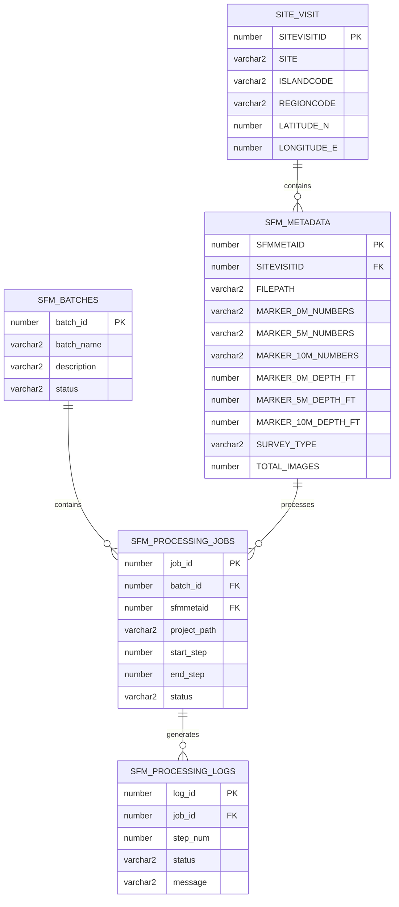

# Reef Mapper | NCRMP Structure-from-Motion Workflow Scripts

These scripts automate the batch processing of georeferenced, time-series coral reef photomosaics using Agisoft Metashape. They follow a Structure-from-Motion (SfM) workflow to generate 3D models and mosaics from photographic images of coral reefs, streamlining the processing pipeline for efficient monitoring and analysis.



## Features

### Core Processing
- **Batch Processing:** Automates the full SfM workflow for multiple sites or datasets
- **Photo Management:** Reads and validates image files from user-specified directories
- **Automated Alignment:** Matches and aligns photos, builds sparse and dense point clouds
- **Marker Detection & Scaling:** Detects ground control markers and applies scale bars
- **Quality Control:** Filters images and points based on quality metrics
- **Export:** Generates and exports DEMs, orthomosaics, and processing reports

### Management & Monitoring
- **Database Integration:** Oracle/SQLite support for robust job tracking
- **Progress Tracking:** Real-time monitoring of processing steps
- **Error Handling:** Comprehensive error capture and reporting
- **Status Dashboard:** Views for monitoring active jobs and performance
- **Job Control:** Prioritization and batch management features
- **Analytics:** Processing statistics and performance metrics

### Technical
- **Multi-version Support:** Scripts for legacy and current Metashape APIs
- **Flexible Storage:** Choose between CSV-based or database-driven logging
- **Transaction Management:** Ensures data integrity during processing
- **Connection Pooling:** Optimized database connections for performance
- **API Compatibility:** Updated for latest Metashape Python API changes

## Overview

### Batch Processing Flow Diagram

```mermaid
graph TD
    A[Start - Set Paths and Initial Parameters] --> B[Generate Photo List]
    B --> C[Find Marker]
    C --> D[MetashapeProcess]
    subgraph _
        D --> E[Step 1: Initialize - Create Products folder, psx file and s]
        E --> F[Step 2: Add, Match, and Align Photos]
        F --> G[Step 3: Generate Sparse Point Cloud]
        G --> H[Step 4: Scaling Process]
        H --> I[Step 5: Reprojection]
        I --> J[Step 6: Generate Dense Point Cloud]
        J --> K[Step 7: Export Results Orthomosaic DEM]
    end
    K --> L[End]

    style A fill:#f9f,stroke:#333,stroke-width:2px
    style B fill:#bbf,stroke:#333,stroke-width:2px
    style C fill:#fb0,stroke:#333,stroke-width:2px
    style D fill:#9f9,stroke:#333,stroke-width:2px
    style E fill:#ff9,stroke:#333,stroke-width:2px
    style F fill:#f96,stroke:#333,stroke-width:2px
    style G fill:#69f,stroke:#333,stroke-width:2px
    style H fill:#c9f,stroke:#333,stroke-width:2px
    style I fill:#f66,stroke:#333,stroke-width:2px
    style J fill:#9ff,stroke:#333,stroke-width:2px
    style K fill:#fc6,stroke:#333,stroke-width:2px
    style L fill:#f96,stroke:#333,stroke-width:2px

``` 

## Batch Processing Scripts

This repository includes three versions of the batch processing scripts for Agisoft Metashape:

### `SfMBatchProcess_v1.py`
- **Description:** Original version of the batch processing script.
- **Compatibility:** Designed for earlier versions of the Metashape Python API.
- **Usage:** Use if you are working with legacy projects or older Metashape installations.

### `SfMBatchProcess_v2.py`
- **Description:** Updated version with compatibility for recent Metashape Python API changes.
- **Key Updates:**
  - Uses `chunk.analyzeImages` instead of `chunk.analyzePhotos`
  - Uses `TiePoints` instead of `PointCloud` for sparse cloud operations
  - Updated export and build function names to match API changes
- **Usage:** For projects using current Metashape versions with CSV-based logging.

### `SfMBatchProcess_db.py`
- **Description:** Latest database-driven version with enhanced tracking and monitoring.
- **Key Features:**
  - Oracle/SQLite database integration for job tracking
  - Detailed step-by-step progress logging
  - Improved error handling and recovery
  - Real-time status monitoring
  - Support for batch processing prioritization
  - Comprehensive processing statistics
- **Usage:** Recommended for production environments and large-scale processing.

### `SfMBatchProcess_v3.py`
- **Description:** Singular script that iterates through steps 1-7 no stopping
- **Usage:** Reference.

### `sfm_metashape_main.py`
- **Description:** Modularized main script that works with steps in steps folder.
- **Usage:** Launch with .bat script and manage via Optical App.


## Inputs & Outputs

**Inputs:**
- A CSV processing log specifying batch/site information.
- Folders containing site images (JPEG/JPG).
- (Optional) Ground control marker information.

**Outputs:**
- Agisoft Metashape project files (.psx and .files).
- Log and readme text files for each batch.
- Exported DEMs, orthomosaics, and reports (in supported formats).


## Quick Start

### For CSV-based Processing (v1/v2)

1. **Install Agisoft Metashape** (Python API required; see [official instructions](https://agisoft.freshdesk.com/support/solutions/articles/31000148930-how-to-install-metashape-stand-alone-python-module)).
2. **Prepare your data:** Organize your images and create a processing log CSV.
3. **Edit the script:** Update the `process_log` and `batch_no` variables in the script to match your data.
4. **Run the script:**  
   ```sh
   python SfMBatchProcess_v2.py  # or v1 for legacy
   ```

### For Database-driven Processing

1. **Install Requirements:**
   ```sh
   pip install cx-Oracle python-dotenv
   ```

2. **Configure Database:**
   - Copy `.env.example` to `.env`
   - Update database credentials
   - Run database setup scripts (see database/DDL)

3. **Initialize Database:**
   ```sql
   @01_create_tables.sql
   @02_create_views.sql
   ```

4. **Run the Script:**
   ```sh
   python SfMBatchProcess_db.py
   ```

For detailed database setup and configuration, see [database/README.md](database/README.md).

## Database-Driven Processing

The database-driven version (`SfMBatchProcess_db.py`) provides comprehensive job tracking and monitoring capabilities. Here's how it works:

### Processing Workflow

1. **Job Setup**
   - Create a batch in `SFM_BATCHES`
   - Reference site information from `SITE_VISIT` table
   - Access marker and metadata from `SFM_METADATA`
   - Create processing jobs in `SFM_PROCESSING_JOBS` linked to `SFM_METADATA`

2. **Batch Processing**
   - System polls for pending jobs from current batch
   - Jobs are processed in priority order
   - Each job moves through steps 1-7
   - Real-time status updates in database

3. **Progress Tracking**
   - Each processing step logs its status
   - Warnings and errors are captured
   - Processing times are recorded
   - Output file locations are tracked

### Database Updates by Processing Stage

#### Job Initialization
```sql
-- When job starts
UPDATE SFM_PROCESSING_JOBS 
SET status = 'running',
    started_at = SYSTIMESTAMP
WHERE job_id = ?

-- Initial log entry
INSERT INTO SFM_PROCESSING_LOGS 
(job_id, step_num, status, message)
VALUES (?, 0, 'started', 'Starting batch processing')
```

#### During Processing Steps
```sql
-- Step start
INSERT INTO SFM_PROCESSING_LOGS 
(job_id, step_num, status, message)
VALUES (?, ?, 'running', 'Starting step')

-- Progress updates
INSERT INTO SFM_PROCESSING_LOGS 
(job_id, step_num, status, message)
VALUES (?, ?, 'info', 'Progress message')

-- Step completion
INSERT INTO SFM_PROCESSING_LOGS 
(job_id, step_num, status, message)
VALUES (?, ?, 'completed', 'Step finished')
```

#### Error Handling
```sql
-- On error
INSERT INTO SFM_PROCESSING_LOGS 
(job_id, step_num, status, message)
VALUES (?, ?, 'error', 'Error message')

UPDATE SFM_PROCESSING_JOBS 
SET status = 'failed',
    error_message = ?,
    completed_at = SYSTIMESTAMP
WHERE job_id = ?
```

#### Job Completion
```sql
-- On successful completion
UPDATE SFM_PROCESSING_JOBS 
SET status = 'completed',
    completed_at = SYSTIMESTAMP
WHERE job_id = ?
```

### Real-time Monitoring

1. **Active Jobs View**
   ```sql
   SELECT * FROM V_SFM_ACTIVE_JOBS;
   ```
   Shows currently running jobs with their progress

2. **Job Statistics**
   ```sql
   SELECT m.SITE, j.status, j.error_message 
   FROM V_SFM_JOB_STATS j
   JOIN SFM_METADATA m ON j.sfmmetaid = m.SFMMETAID
   JOIN SITE_VISIT s ON m.SITEVISITID = s.SITEVISITID
   WHERE j.batch_id = 1;
   ```
   Provides completion rates and error counts

3. **Step Performance**
   ```sql
   SELECT * FROM V_SFM_STEP_STATS;
   ```
   Shows average completion times and success rates

### Database Structure


```mermaid
erDiagram
    SITE_VISIT ||--o{ SFM_METADATA : contains
    SFM_BATCHES ||--o{ SFM_PROCESSING_JOBS : contains
    SFM_METADATA ||--o{ SFM_PROCESSING_JOBS : processes
    SFM_PROCESSING_JOBS ||--o{ SFM_PROCESSING_LOGS : generates

    SITE_VISIT {
        number SITEVISITID PK
        varchar2 SITE
        varchar2 ISLANDCODE
        varchar2 REGIONCODE
        number LATITUDE_N
        number LONGITUDE_E
    }

    SFM_METADATA {
        number SFMMETAID PK
        number SITEVISITID FK
        varchar2 FILEPATH
        varchar2 MARKER_0M_NUMBERS
        varchar2 MARKER_5M_NUMBERS
        varchar2 MARKER_10M_NUMBERS
        number MARKER_0M_DEPTH_FT
        number MARKER_5M_DEPTH_FT
        number MARKER_10M_DEPTH_FT
        varchar2 SURVEY_TYPE
        number TOTAL_IMAGES
    }

    SFM_BATCHES {
        number batch_id PK
        varchar2 batch_name
        varchar2 description
        varchar2 status
    }

    SFM_PROCESSING_JOBS {
        number job_id PK
        number batch_id FK
        number sfmmetaid FK
        varchar2 project_path
        number start_step
        number end_step
        varchar2 status
    }

    SFM_PROCESSING_LOGS {
        number log_id PK
        number job_id FK
        number step_num
        varchar2 status
        varchar2 message
    }
```

### Key Database Features

- **Batch Management:** Group and prioritize processing jobs
- **Metadata Integration:** Direct integration with existing `SFM_METADATA` system
- **Site Information:** Access to comprehensive site visit data
- **Marker Tracking:** Detailed marker information at various distances
- **Job Control:** Monitor job status and progress
- **Detailed Logging:** Track each processing step
- **Error Handling:** Capture and track issues
- **Performance Metrics:** Monitor processing times and success rates

### Monitoring Views

- **V_SFM_ACTIVE_JOBS:** Currently running jobs with progress
- **V_SFM_JOB_STATS:** Processing statistics and error counts
- **V_SFM_STEP_STATS:** Step-level timing and success metrics

For detailed database setup and schema information, see [database/README.md](database/README.md).

## Batch Processing Guide

### Setting Up a Batch

1. **Create a Batch**
   ```sql
   INSERT INTO SFM_BATCHES (batch_name, description) 
   VALUES ('Batch2025Q2', '2025 Q2 Survey Processing');
   ```

2. **Reference Site Visit**
   ```sql
   SELECT SITEVISITID, SITE, LATITUDE_N, LONGITUDE_E 
   FROM SITE_VISIT 
   WHERE SITE = 'SITE001';
   ```

3. **Access Marker and Metadata**
   ```sql
   SELECT SFMMETAID, MARKER_0M_NUMBERS, MARKER_5M_NUMBERS, MARKER_10M_NUMBERS
   FROM SFM_METADATA
   WHERE SITEVISITID = ?;
   ```

4. **Create Processing Jobs**
   ```sql
   INSERT INTO SFM_PROCESSING_JOBS 
   (batch_id, sfmmetaid, project_path, start_step, end_step, priority)
   VALUES (1, ?, '/path/to/images', 1, 7, 1);
   ```

### Running a Batch

1. **Set Batch Number**
   ```python
   # In SfMBatchProcess_db.py
   batch_no = 1  # Set to your batch ID
   ```

2. **Start Processing**
   ```bash
   python SfMBatchProcess_db.py
   ```

3. **Monitor Progress**
   ```sql
   -- Check active jobs
   SELECT * FROM V_SFM_ACTIVE_JOBS;
   
   -- Check completion status
   SELECT m.SITE, j.status, j.error_message 
   FROM V_SFM_JOB_STATS j
   JOIN SFM_METADATA m ON j.sfmmetaid = m.SFMMETAID
   JOIN SITE_VISIT s ON m.SITEVISITID = s.SITEVISITID
   WHERE j.batch_id = 1;
   ```

### Batch Control Features

1. **Job Prioritization**
   - Jobs are processed in priority order (higher numbers first)
   - Update priorities for urgent jobs:
     ```sql
     UPDATE SFM_PROCESSING_JOBS 
     SET priority = 10 
     WHERE job_id = ?;
     ```

2. **Pause/Resume**
   - Pause specific jobs:
     ```sql
     UPDATE SFM_PROCESSING_JOBS 
     SET status = 'pending' 
     WHERE job_id = ?;
     ```

3. **Error Recovery**
   - Review failed jobs:
     ```sql
     SELECT * FROM SFM_PROCESSING_JOBS 
     WHERE status = 'failed';
     ```
   - Restart from last successful step:
     ```sql
     UPDATE SFM_PROCESSING_JOBS 
     SET status = 'pending',
         start_step = last_successful_step + 1
     WHERE job_id = ?;
     ```

### Best Practices

1. **Batch Organization**
   - Group related sites in the same batch
   - Use consistent naming conventions
   - Set appropriate priorities

2. **Monitoring**
   - Regularly check V_SFM_ACTIVE_JOBS
   - Review error logs promptly
   - Monitor processing times

3. **Maintenance**
   - Archive completed batches
   - Clean up old log entries
   - Update statistics regularly

## Manual Job Management and Processing Flow

Once your site visit and metadata records are created and reviewed, you control which jobs are processed by managing the `SFM_PROCESSING_JOBS` table. Here’s the recommended workflow:

### 1. Review and Prepare Metadata
- Ensure all required site and survey metadata is present in `SITE_VISIT` and `SFM_METADATA`.
- Validate marker numbers, depths, file paths, and survey details.

### 2. Create Processing Jobs
- Once image QC  has been marked in the Optical App, a record will be created in `SFM_PROCESSING_JOBS` for each site/survey you want to process.
- Set the priority as a number for the order in which you'd like them to run. Once priority is saved, the status will be updated to `'pending'`.

- Manual Example:
  ```sql
  INSERT INTO SFM_PROCESSING_JOBS (
      batch_id, sfmmetaid, project_path, start_step, end_step, quality, survey_year, priority, status
  ) VALUES (
      1, 123, '/path/to/images', 1, 7, 0.7, '2025', 1, 'pending'
  );
  ```

### 3. Review and Edit Jobs
- Query jobs to review before processing:
  ```sql
  SELECT * FROM SFM_PROCESSING_JOBS WHERE batch_id = 1;
  ```
- Update jobs as needed (change steps, quality, etc.):
  ```sql
  UPDATE SFM_PROCESSING_JOBS SET start_step = 2, quality = 0.8 WHERE job_id = 123;
  ```
- To re-run a job, set its status back to `'pending'` and adjust `start_step`:
  ```sql
  UPDATE SFM_PROCESSING_JOBS SET status = 'pending', start_step = 3 WHERE job_id = 123;
  ```

### 4. Run the Batch Processor
- The script will process jobs with `status = 'pending'` in priority order.
- Each job moves through the defined steps (1–7), with progress and errors logged in `SFM_PROCESSING_LOGS`.

### 5. Monitor and Control Jobs
- Use the provided views to monitor active jobs and review statistics:
  - `V_SFM_ACTIVE_JOBS` for running jobs
  - `V_SFM_JOB_STATS` for job-level stats
  - `V_SFM_STEP_STATS` for step performance
- Pause, resume, or restart jobs by updating their status and step fields.

### 6. Repeat or Edit as Needed
- You can add, edit, or re-run jobs at any time by updating the `SFM_PROCESSING_JOBS` table.
- The workflow is fully manual and flexible, allowing you to control processing and recovery.

---

**Summary:**
- Prepare and review metadata
- Manually create and edit jobs
- Run the processor to execute jobs
- Monitor, pause, or re-run jobs as needed
- All control is via SQL or your preferred database tool

## References
- [Agisoft Metashape Python API Documentation](https://www.agisoft.com/pdf/metashape_python_api_2_0_0.pdf)
- [Metashape Automation Scripts](https://github.com/agisoft-llc/metashape-scripts/tree/master)

## License
See the [LICENSE.md](./LICENSE.md) for details.

## Disclaimer
This repository is a scientific product and is not official communication of the National Oceanic and Atmospheric Administration, or the United States Department of Commerce. All NOAA GitHub project code is provided on an ‘as is’ basis and the user assumes responsibility for its use. Any claims against the Department of Commerce or Department of Commerce bureaus stemming from the use of this GitHub project will be governed by all applicable Federal law. Any reference to specific commercial products, processes, or services by service mark, trademark, manufacturer, or otherwise, does not constitute or imply their endorsement, recommendation or favoring by the Department of Commerce. The Department of Commerce seal and logo, or the seal and logo of a DOC bureau, shall not be used in any manner to imply endorsement of any commercial product or activity by DOC or the United States Government.
