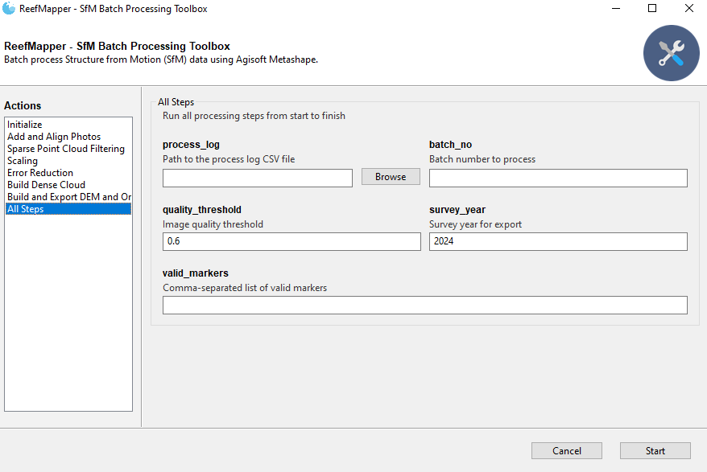

# Reef Mapper | NCRMP Structure-from-Motion Workflow Scripts

These scripts automate the batch processing of georeferenced, time-series coral reef photomosaics using Agisoft Metashape. They follow a Structure-from-Motion (SfM) workflow to generate 3D models and mosaics from photographic images of coral reefs, streamlining the processing pipeline for efficient monitoring and analysis.


## Features
- **Batch Processing:** Automates the full SfM workflow for multiple sites or datasets.
- **Photo Management:** Reads and validates image files from user-specified directories.
- **Automated Alignment:** Matches and aligns photos, builds sparse and dense point clouds.
- **Marker Detection & Scaling:** Detects ground control markers and applies scale bars.
- **Quality Control:** Filters images and points based on quality metrics.
- **Export:** Generates and exports DEMs, orthomosaics, and processing reports.
- **Logging:** Logs all processing steps and results for reproducibility and troubleshooting.
- **Compatibility:** Two script versions for legacy and current Metashape Python APIs.

## Overview

### Batch Processing Flow Diagram


## Batch Processing Scripts

This repository includes two main batch processing scripts for Agisoft Metashape:

### `SfMBatchProcess_v1.py`
- **Description:** Original version of the batch processing script.
- **Compatibility:** Designed for earlier versions of the Metashape Python API.
- **Usage:** Use if you are working with legacy projects or older Metashape installations.

### `SfMBatchProcess_v2.py`
- **Description:** Updated version with compatibility for recent Metashape Python API changes (see changelog in script header).
- **Key Updates:**
  - Uses `chunk.analyzeImages` instead of `chunk.analyzePhotos`.
  - Uses `TiePoints` instead of `PointCloud` for sparse cloud operations.
  - Updated export and build function names to match API changes.
- **Usage:** Recommended for new projects and current Metashape versions.

## Inputs & Outputs

**Inputs:**
- A CSV processing log specifying batch/site information.
- Folders containing site images (JPEG/JPG).
- (Optional) Ground control marker information.

**Outputs:**
- Agisoft Metashape project files (.psx and .files).
- Log and readme text files for each batch.
- Exported DEMs, orthomosaics, and reports (in supported formats).


## Quick Start

1. **Install Agisoft Metashape** (Python API required; see [official instructions](https://agisoft.freshdesk.com/support/solutions/articles/31000148930-how-to-install-metashape-stand-alone-python-module)).
2. **Prepare your data:** Organize your images and create a processing log CSV.
3. **Edit the script:** Update the `process_log` and `batch_no` variables in the script to match your data.
4. **Run the script:**  
   ```sh
   python SfMBatchProcess_v2.py
   ```
   (or `SfMBatchProcess_v1.py` for legacy workflows)


## App (work-in-progress)


## References
- [Agisoft Metashape Python API Documentation](https://www.agisoft.com/pdf/metashape_python_api_2_0_0.pdf)
- [Metashape Automation Scripts](https://github.com/agisoft-llc/metashape-scripts/tree/master)

## License
See the [LICENSE.md](./LICENSE.md) for details.

## Disclaimer
This repository is a scientific product and is not official communication of the National Oceanic and Atmospheric Administration, or the United States Department of Commerce. All NOAA GitHub project code is provided on an ‘as is’ basis and the user assumes responsibility for its use. Any claims against the Department of Commerce or Department of Commerce bureaus stemming from the use of this GitHub project will be governed by all applicable Federal law. Any reference to specific commercial products, processes, or services by service mark, trademark, manufacturer, or otherwise, does not constitute or imply their endorsement, recommendation or favoring by the Department of Commerce. The Department of Commerce seal and logo, or the seal and logo of a DOC bureau, shall not be used in any manner to imply endorsement of any commercial product or activity by DOC or the United States Government.
