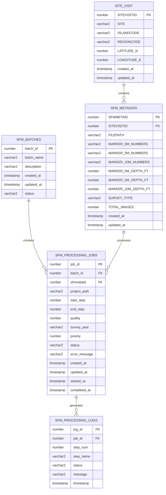

# Database Structure

## Tables

### SITE_VISIT
- Stores information about reef site visits
- Includes location, codes, and mission info

### SFM_METADATA
- Contains detailed metadata for each site visit
- Marker numbers, depths, survey type, total images, etc.

### SFM_BATCHES
- Groups multiple processing jobs together
- Tracks overall batch status and metadata

### SFM_PROCESSING_JOBS
- Main processing job information
- Tracks individual site processing status and progress
- Links to both batches and SFM_METADATA

### SFM_PROCESSING_LOGS
- Detailed processing logs
- Step-by-step status updates and messages
- Links to processing jobs

## Views

### V_SFM_ACTIVE_JOBS
- Shows currently running jobs
- Includes site and batch information
- Calculates running time

### V_SFM_JOB_STATS
- Job-level statistics
- Error and warning counts
- Processing duration

### V_SFM_STEP_STATS
- Statistics by processing step
- Average completion times
- Error counts by step

## Setup Instructions

1. Install required packages:
```bash
pip install cx-Oracle python-dotenv
```

2. Create the `.env` file:
```env
DB_TYPE=oracle
ORACLE_USER=your_username
ORACLE_PASSWORD=your_password
ORACLE_DSN=your_connection_string
ORACLE_MIN_CONNECTIONS=2
ORACLE_MAX_CONNECTIONS=5
ORACLE_CONNECTION_INCREMENT=1
```

3. Run the DDL scripts in order:
```sql
@01_create_tables.sql
@02_create_views.sql
```

## Database Relationships

- Each batch can contain multiple processing jobs
- Each SFM_METADATA record can have multiple processing jobs (for different years/surveys)
- Each site visit can have multiple metadata records
- Each job generates multiple log entries
- Jobs are linked to both batches and SFM_METADATA

## Status Values

### Batch Status
- pending
- processing
- completed
- failed

### Job Status
- pending
- running
- completed
- failed

### Log Status
- started
- running
- completed
- failed
- warning
- error
- info

## Notes

- All tables include created_at/updated_at timestamps
- Jobs track priority for processing order
- Marker numbers and depths are stored in SFM_METADATA
- Step numbers range from -1 to 7 (-1 for system messages)
- Quality values must be between 0 and 1
